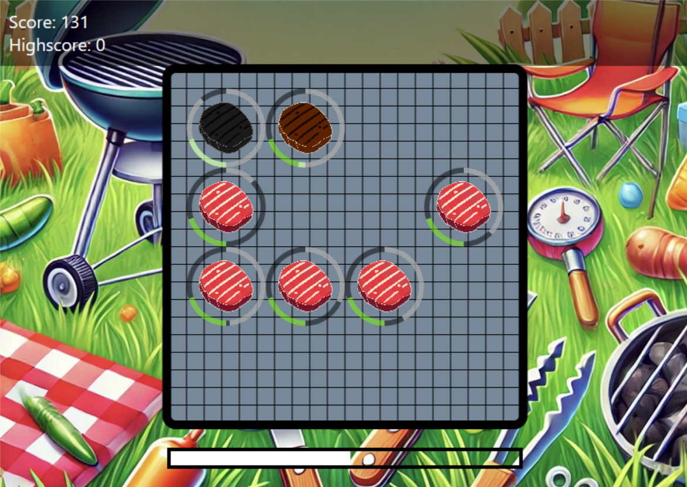

# Base for a DirectX 2D Game

## Engine
- To create new game you just need to derive the `App` class (e.g. `MyGameApp`) and inside create one `GameObject` that manages the game
- Additional settings (e.g. window size, framerate cap) are inherited from in `App::Config`
- Everything you need to `Update` and `Draw` on the screen is a `GameObject`, just derive this class and create the object.
  - Tip: Deriving `GameObject` also requires implementing `InitResources` method.
    - <b>Don't</b> call it directly. <b>Use</b> `Microsoft::WRL::ComPtr` smart pointer to store DirectX resource types. 

## Example Game 

Grill Master - challenge your focus and reaction time on the BBQ. 

